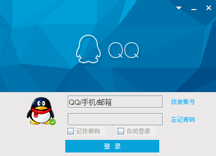
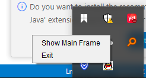
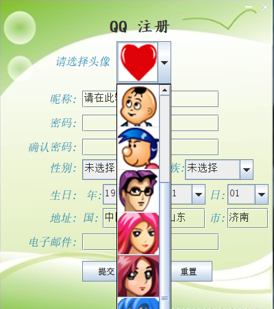
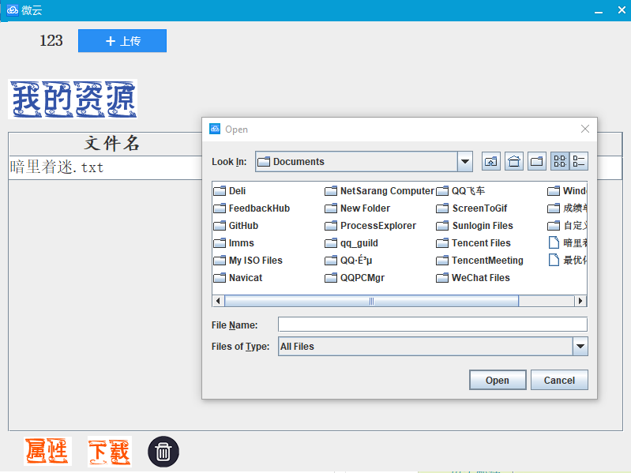

# TencentQQ2

#### 介绍

Java 简单的GUI项目, 模仿的腾讯QQ, 主要是为了熟悉面向对象与三层架构, 另外还有MVC模式

现在看来是非常低级的程序操作，但是对于一个刚刚学会JavaSE 和 JDBC 的普通人来说，确实是一个非常值得挑战的工作，至少是培养了写代码的耐心。过了耐心这一关，对待什么都会好的，另外还要讲究方式方法

# 项目

## 功能需求

### 登陆

- 登陆时使用我们的QQ号码进行登陆, 在输入密码后进行, 将密码获取后也来一次摘要,
  我们只对摘要进行比较.
- 找回密码, 可以~~使用短信验证和邮箱验证~~

### 注册

- 注册的时候需要输入的信息有: nickname, password, photo, age, gender, birthday,
  country, province, city, nation, description.
- 昵称, 密码, 头像, 年龄, 性别, 生日, 国家, 省, 城市, 民族, 个人说明
- 注册后, 自动分配QQ号码, 这个号码是5位数的.
- 注册后, 将这个QQ号码加入到我们的数据库中, 加入时我们使用md5摘要算法进行一次摘要
- 每当我们注册后我们就会在数据库中创建一个以table开头, QQ号码结尾的表, 表中有两个表项,
  id 和QQ好友号码

### 云

- 点击后出现一个面板, 下面会有一个文本框, 一行一行的
- 有三个按钮, 上传, 下载, 删除
- 上传, 打开一个文件选择框, 只能单选, 选择后点完OK之后, 获取到该文件的实际地址,
  并将地址保存在数据库中, 将文件名字保存在下面的框中.
- 删除, 选中之后将我们的这个文本删除就好了, 然后数据库的状态位设置为0, 若没有选中,
  则弹出提示框
- 下载, 选中我们已经存在的文件, 然后点击下载按钮, 弹出一个地址选择框, 如果选中了文件,
  就弹出一个提示框, 已存在是否要覆盖, 如果没有选中文件, 则弹出一个框, 显示没有选中文件.

### QQ推箱子

- 在我们的主面板上有一个QQGame 的图标我们可以将那个

### 修改信息

- 为了简便我们这个和我们的注册界面是一样的

### 查找好友

- 一共有四个个框, 按QQ号码查找, 按昵称查找,按性别查找. 按年龄段查找
- 性别有选项, 年龄段也有选项.
- 昵称使用模糊查询
- QQ号码精确查询

### 显示好友列表

- 可以使用滚动条.
- 分多个面板使用多个滚动条

### 聊天窗口

- 聊天窗口首先有一个自己可以输入的文本框, 在右下角有一个发送按钮, 若没有聊天内容,
  则就会跳出来几行可以选择的文本, 然后放在文本框中, 再次点击就会发送过去.
- 在文本框中点击右键可以出现字体设置,
- 中间的过度地方可以, 发送文件, 也是文件选择框. 中间的过度地方也可以设置字体,
  也可以发送小表情
- 窗口的右边会出现一个图片, 是对方可以设置的.
- 有一个聊天记录按钮, 聊天记录保存在本地工程下的document里面

## <span id="jump">数据库设计</span>

### <span id="register">用户注册</span>

- 用户表qq_table

  | 字段名      | 字段类型               | 备注           |
  | ----------- | ---------------------- | -------------- |
  | qq_id       | int primary key        | qq号码存储的id |
  | qq_number   | int(5) not null unique | qq号码         |
  | qq_nickname | varchar(12)            | 昵称           |
  | qq_password | char(32)               | 密码的md5      |
  | qq_photo    | blob                   | 头像           |
  | qq_gender   | varchar(4)             | 性别           |
  | qq_birthday | date                   | 生日           |
  | qq_country  | varchar(20)            | 国家           |
  | qq_province | varchar(10)            | 省             |
  | qq_city     | varchar(10)            | 城市           |
  | qq_nation   | varchar(10)            | 民族           |
  | qq_email     | varchar(25)            | 邮箱           |
  | qq_state    | char(1) default '1'    | 状态位         |
  | qq_register | datetime               | 注册日期       |

- 与之对应的好友表

- qq**friend_table

  | 字段名    | 字段类型                       | 备注                     |
  | --------- | ------------------------------ | ------------------------ |
  | id        | int primary key auto_increment | 好友的id                 |
  | qq_number | int(5) not null unique         | 好友的号码(外键qq_table) |

### 微云

- qq_cloud****

  | 字段名      | 字段类型            | 备注                        |
  | ----------- | ------------------- | --------------------------- |
  | cloud_id      | int primary key     | 存储的文件id                |
  | cloud_address | varchar(255)        | 存储的文件地址              |
  | cloud_state   | char(1) default '1' | 状态位, 1就存在, 2 就不存在 |
  | cloud_time    | datetime            | 存储日期                    |


# 使用方法

该项目是一个使用Maven构建的Java项目

## 使用方法

1. 克隆项目到本地：

   ```shell
   git clone https://github.com/lutong99/qq-like-swing-ui.git
   ```

2. 进入项目目录：

   ```shell
   cd qq-like-swing-ui
   ```


3. 根据database 目录下的两个sql 文件进行数据库的创建。

4. 构建项目：

   ```shell
   mvn clean install
   ```

5. 运行项目：

   ```shell
   mvn exec:java -Dexec.mainClass="org.example.main.Main"
   ```

6. (可选) 生成可执行JAR文件：

   ```shell
   mvn package
   ```

   可执行JAR文件将生成在 `target` 目录下。

## 配置

在项目中的 `src/main/resources` 目录下可以找到 `druid.properties` 数据源配置文件。根据需要进行相应的配置修改。

## 文档

demo的部分文档可以在 `docs` 目录中找到。该目录包含了关于项目的更多信息和使用指南。


## 使用方法及贴图

- 1、登录界面

  

  当鼠标移动到关闭和最小化时，会触发切颜色变化的效果

  任务栏区

  

- 2、注册界面


  

  选择头像

  

  信息填写

  


  注册成功
  
  


- 登录成功主界面

  

  只有画红线的四个功能可用，其中第二个QQ音乐可以调用本机上的QQMusic 程序，但需要改路径，在`resources/config.properties` 的`music.path` 中。

  任务栏显示的图标和头像是一致的


- 微云

  

  是一个列表，可以上传，可以下载，可以删除，图中显示的是上传的框


- 游戏选择界面

  

  其中推箱子不可用

  

  


## 改进

  如果有时间的话：

  未来考虑，把一些写死的资源动态起来，

  添加一些新的功能。比如查找好友

  好友聊天等。

  